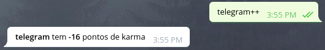

### Karma plugin

karma plugin é uma maneira divertida de dar like ou dislike para palavras, objetos, usuários, etc.

É bem simples, basta utilizar `++` ou `--` no final de alguma palavra que o bot irá reconhecer o padrão e alterar o karma.
Veja como é simples:

Mas se tentar alterar o karma de algo repetidamente, o bot não irá permitir:

Também é possível pesquisar o karma de uma palavra chave, exemplo:

### Encontrou bugs ou tem alguma sugestão?
Não hesite em nos procurar, registre um issue ou nos envie um email: contato@jbugbrasil.com.br