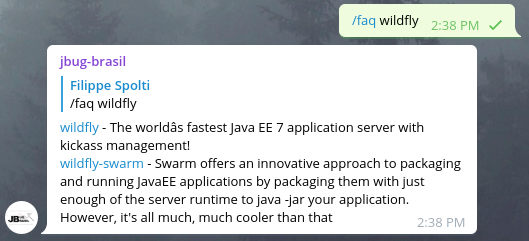

### Serviço Faq

O serviço Faq onde o usuário digita algum projeto Open Source e o bot responde com informações sobre o bot, veja este exemplo:



### Como funciona?

Durante a inicialização do bot este serviço será inicializado e durante este processo um arquivo JSON será lido e persistido em cache.
O arquivo é relido se os registros no cache substituidos, se o arquivo JSON estiver sido alterado, as novas informações jão estarão disponíveis
no bot.

O arquivo utilizado pelo bot é [este](https://github.com/jbug-brasil/bots/blob/master/jbugbrasil-telegram-bot/services/faq-service/src/main/resources/META-INF/faq-properties.json).
Ele está estruturado de forma bem simples, que consiste em seu ID ou nome, descrição e link do site do projeto, veja este exemṕlo:

```json
  {
    "id": "wildfly",
    "link": "http://wildfly.org",
    "description": "The worldâs fastest Java EE 7 application server with kickass management!"
  }
```

Para Adicionar novos projetos Open Source neste arquivo basta abrir um Pull Request com suas alterações.

### Encontrou bugs ou tem alguma sugestão?
Não hesite em nos procurar, registre um issue ou nos envie um email: contato@jbugbrasil.com.br