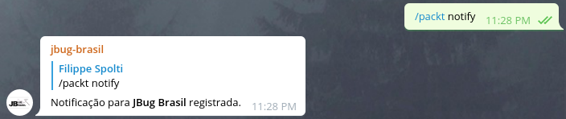
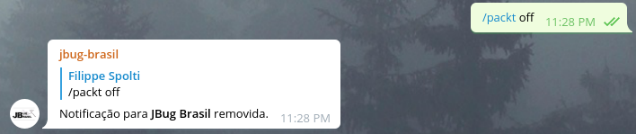

### Serviço Packt Publishing - Free Learning

Todos os dias a Packt Publishing oferece um de sesus livros de forma gratuita através deste [link](https://www.packtpub.com/packt/offers/free-learning).

### Como funciona?

Este serviço possui um único objetivo, enviar notificações diárias com o nome do livro e a url para obter sua cópia gratuita do livro.
O serviço aceita os seguintes comandos:
 - /packt notify: Se o comando partiu de um grupo irá ativar os alertas para o grupo em questão, caso contrário, se em chat privado, irá ativar somente para o usuário que executou o comando, exemplo:
     
   
 - /packt off: Remove a notificação ativa de grupo ou chat privado do qual o comando se originou.
    

 - /packt: apenas retorna o livro do dia, exemplo:
    

Para Adicionar novos projetos Open Source neste arquivo basta abrir um Pull Request com suas alterações.

### Encontrou bugs ou tem alguma sugestão?
Não hesite em nos procurar, registre um issue ou nos envie um email: contato@jbugbrasil.com.br
