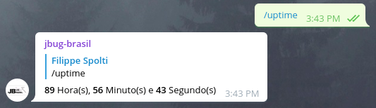

### Serviço Uptime

Comando para informar o usuário por quanto tempo o bot está em execução:

### Encontrou bugs ou tem alguma sugestão?
Não hesite em nos procurar, registre um issue ou nos envie um email: contato@jbugbrasil.com.br