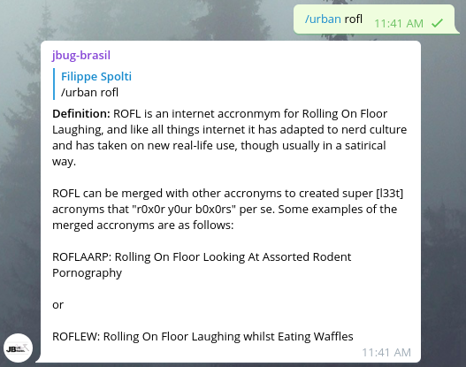
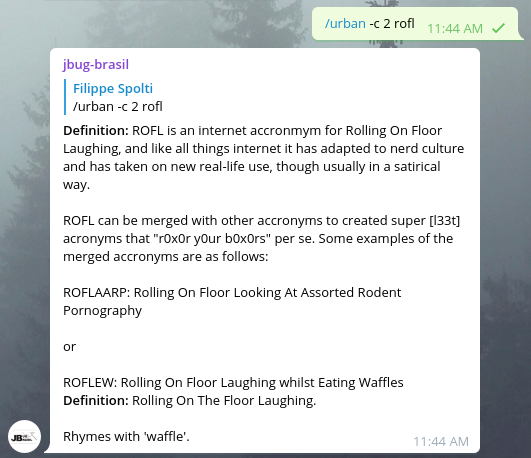
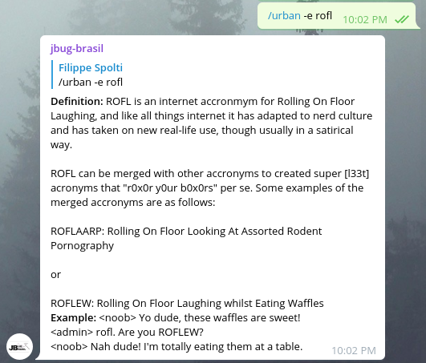

### Comando Urban Dictionary

Quem nunca quis saber o significado de uma gíria em Inglês enquanto conversa com alguém em um chat. Este comando
lhe permite obter o significado de alguma gíria além de exemplos de seu uso, por exemplo, a gíria ```rofl```, você sabe o significado?
Veja como é simples:



Caso o resultado retornado não tenha muito contexto é possível pedir para o bot mais de 1 definição através do parâmetro ```-c X```, onde X é o número de 
definições que você deseja obter:



Ainda é possível pedir um exemplo de como utilizar a gíria:



### Encontrou bugs ou tem alguma sugestão?
Não hesite em nos procurar, registre um issue ou nos envie um email: contato@jbugbrasil.com.br